# StreamTV

**Một bộ UI Android TV hoàn chỉnh, chạy được, không phải một tập màn hình mẫu.**

StreamTV là ứng dụng Android TV viết bằng Jetpack Compose for TV, tổ chức theo Clean Architecture
trong **một app module**. Toàn bộ nội dung hiển thị trong ứng dụng dùng tiếng Anh.

Dự án bao gồm bảy màn hình đầy đủ — Home, Search, Calendar, Setting, Profile và hai player — cùng
một bộ component TV dùng lại được: hero banner tự phát trailer, portrait carousel, `ContentRow` loop
vô hạn, EPG dạng lưới, bàn phím ảo, và một player có controller tự ẩn với ba side section. Mọi
hành vi focus trong dự án đều **cố ý và có thể tái tạo**, không phải kết quả tình cờ của thuật toán
focus search.

> Toàn bộ ảnh và GIF dưới đây được chụp tự động từ emulator bằng [`tools/capture_media.py`](tools/capture_media.py).
> Các demo player dùng cùng một nội dung — stream Big Buck Bunny — để dễ so sánh giữa hai orientation.

---

## Mục lục

| | |
|---|---|
| [1. Home](#1-home--nội-dung-trước-giao-diện-sau) | Hero banner, trailer, các rail nội dung |
| [2. Focus là con trỏ trên TV](#2-focus-là-con-trỏ-trên-tv) | TopBar, ContentRow, quy tắc D-pad |
| [3. Search, Calendar, Setting, Profile](#3-search-calendar-setting-và-profile) | Bốn destination còn lại |
| [4. Player ngang](#4-player-ngang) | Controller, focus restore, ba side section |
| [5. Player dọc](#5-player-dọc) | Stage 9:16, interaction panel |
| [6. Hai player, một ViewModel](#6-hai-player-một-viewmodel) | Bảng so sánh |
| [7. Tự chụp lại bộ ảnh này](#7-tự-chụp-lại-bộ-ảnh-này) | `tools/capture_media.py` |
| [Tham chiếu kỹ thuật](#tham-chiếu-kỹ-thuật) | Kiến trúc, navigation, DI, build |

---

## 1. Home — nội dung trước, giao diện sau

Người xem ngồi cách màn hình vài mét và chỉ có bốn phím mũi tên. Home vì thế nhường phần lớn
viewport đầu tiên cho artwork: một tiêu đề ngắn, một mô tả gọn, và **một** hành động chính nằm trên
scrim tối nhiều lớp bảo vệ khả năng đọc mà không che ảnh.

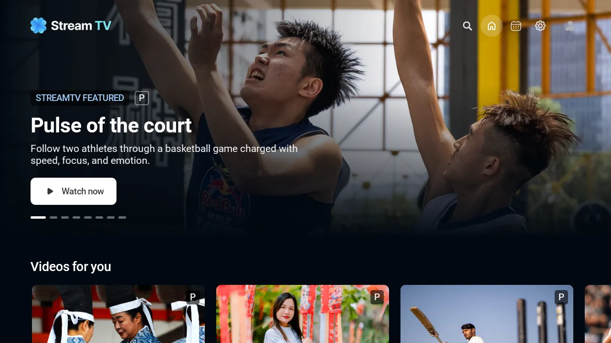

*Hero banner cao 600dp nằm phía sau TopBar overlay. Rail đầu tiên bắt đầu ngay dưới hero để báo hiệu
người xem có thể đi xuống tiếp.*

### Hero banner tự phát trailer

Đây là chi tiết một ảnh tĩnh không thể diễn tả. Thumbnail giữ 5 giây, sau đó trailer của **chính
item đang focus** fade in đè lên thumbnail, chạy loop, không controller, không âm thanh nổi bật.

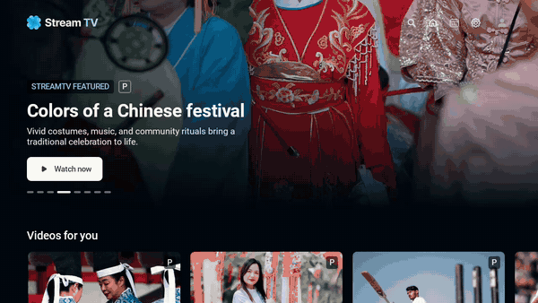

*Từ ảnh tĩnh sang trailer: title, mô tả và CTA giữ nguyên vị trí và vẫn đọc được xuyên suốt.*

Trailer chỉ chạy khi carousel đang giữ focus **và** screen đang `RESUMED`. Rời focus, đổi item, mở
player hoặc app xuống background đều dừng và unload player. Trailer lỗi hoặc thiếu `trailerUrl` thì
banner vẫn là ảnh tĩnh — thumbnail không bao giờ bị bỏ đi. Chi tiết: [`docs/home-banner-trailer/`](docs/home-banner-trailer/).

### Các rail nội dung

Home nhận một danh sách section dọc; mỗi section sở hữu `title`, `viewType` và danh sách content
ngang. Bốn `viewType` khác nhau, cùng một component nền là `ContentRow`.

<table>
<tr>
<td width="50%">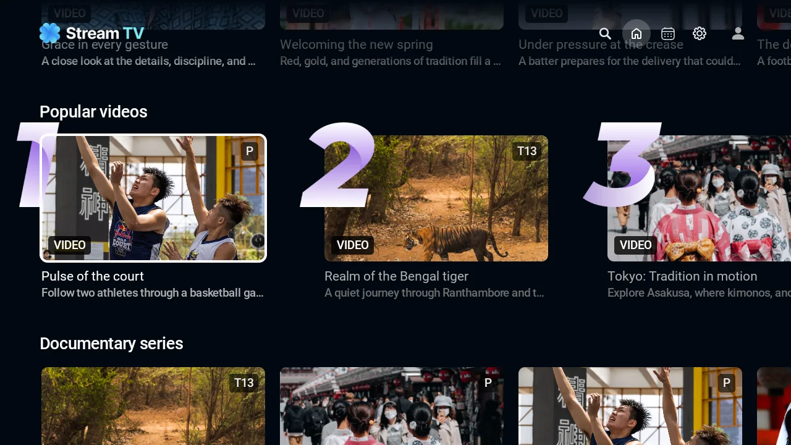</td>
<td width="50%">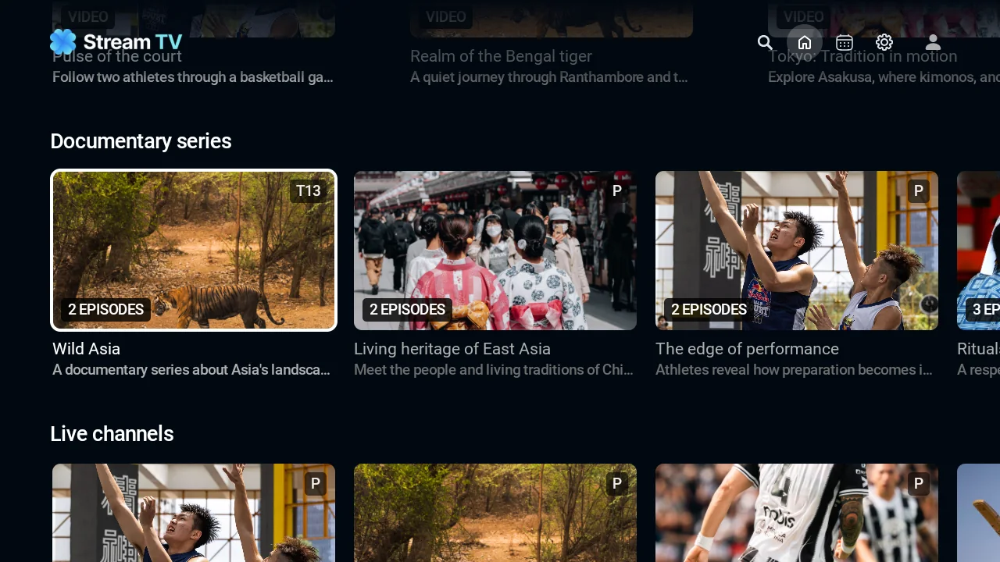</td>
</tr>
<tr>
<td><em><strong>Popular videos</strong> — rail xếp hạng, số thứ tự vẽ tràn ra ngoài card bên trái.</em></td>
<td><em><strong>Documentary series</strong> — card kèm badge số tập, giữ finite vì chỉ có 4 item.</em></td>
</tr>
<tr>
<td>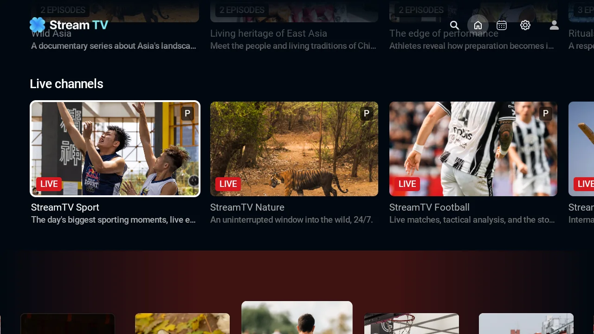</td>
<td>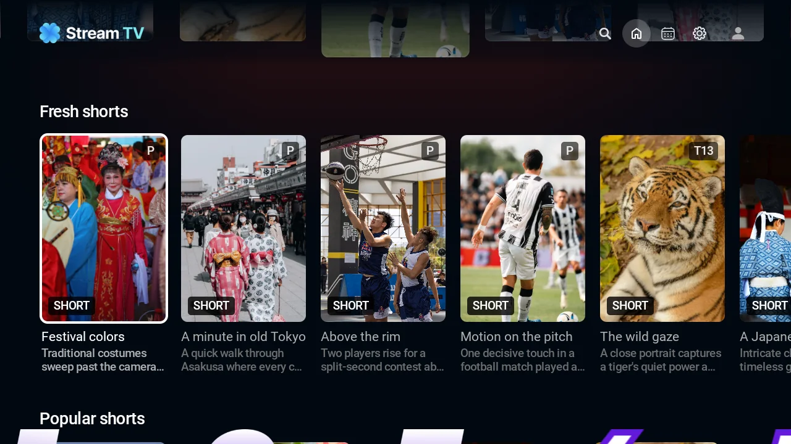</td>
</tr>
<tr>
<td><em><strong>Live channels</strong> — badge LIVE đỏ; các stream này không có duration nên player sẽ bỏ seek bar.</em></td>
<td><em><strong>Fresh shorts</strong> — thumbnail dọc 2:3, mở bằng player dọc thay vì player ngang.</em></td>
</tr>
</table>

Thumbnail **không bị làm tối** theo selection. Selection chỉ làm sáng title và thêm border trắng —
làm tối ảnh khiến rail trông như bị disable khi lướt nhanh.

### Portrait carousel

`VerticalBanner` hiển thị `Short` theo tỷ lệ 2:3 trên một virtual pager dài, loop khi có ít nhất 5
item, preload 5 page quanh viewport.

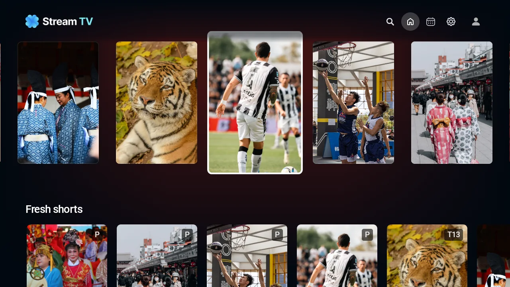

*Item ở giữa được scale lên, và nền của cả section đổi màu theo palette trích từ thumbnail đang
active — mỗi lần chuyển item là một lần chuyển tông màu.*

---

## 2. Focus là con trỏ trên TV

Trên TV không có con trỏ chuột. Focus **là** con trỏ, nên nó phải luôn nhìn thấy được và luôn có
đúng một chủ sở hữu sau mỗi transition. StreamTV không dùng `FocusRequesterModifiers` chung: hành vi
focus được khai báo ngay tại composable sở hữu nó.

### TopBar mở rộng khi nhận focus

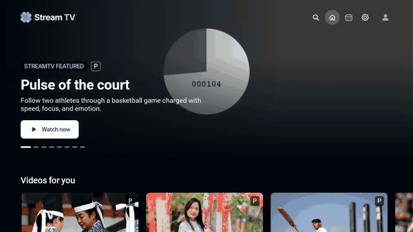

*Item TopBar bình thường chỉ có icon; khi nhận focus nó giãn ngang khoảng 180ms và lộ nhãn tiếng
Anh. Profile giữ nguyên dạng icon tròn. Khi TopBar giữ focus, một lớp `surface` bán trong suốt phủ
lên toàn bộ nội dung phía dưới để quyền điều hướng hiện đang thuộc về ai là điều rõ ràng.*

Ba quy tắc quan trọng:

- **Destination không cướp focus.** Chọn một destination khác vẫn để focus ở TopBar. Destination chỉ
  giành focus khi TopBar không giữ — tức là lúc khởi động nguội và lúc quay về từ player.
  Xem [`docs/adr/2026-09-02-shell-focus-ownership.md`](docs/adr/2026-09-02-shell-focus-ownership.md).
- **Vào lại TopBar là khôi phục destination đang chọn**, không phải nhảy về item đầu.
- **TopBar có overlay riêng** — gradient dọc từ `surface` xuống trong suốt — do màn đang hiện bật/tắt.
  Home chỉ bật khi focus rời section đầu tiên, vì Banner full-bleed đã có scrim riêng.

### ContentRow: một focus target, danh sách trượt bên dưới

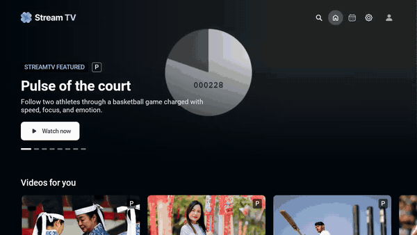

*Xuống rail, rồi sang phải trong rail. Selector đứng yên tại leading content edge; chính danh sách
mới là thứ trượt bên dưới nó.*

Đây là điểm khác biệt lớn nhất so với một `LazyRow` thông thường:

- Toàn bộ row chỉ có **một** focus target — `SelectedItem` trong suốt có border, cố định tại leading
  content edge. Card bên dưới **không** được gắn `focusable`.
- Border selector rộng hơn content 2dp mỗi cạnh, tạo khoảng thở mà không đổi kích thước card.
- Row luôn đo thêm item ngoài hai biên, nên chuyển động không bao giờ lộ khoảng trống.
- Khi có **hơn 5 item**, provider nối thêm một cycle đầy đủ của collection, và sau animation qua cuối
  thì state rebase về cycle đầu — loop vô hạn mà không nhảy hình. Collection **tối đa 5 item** giữ
  finite: Right ở item cuối không reset về item `0`.
- Ở item `0`, không có item giả phía trái và D-pad Left trả quyền xử lý về `FocusRequester.Default`
  để focus thoát ra ngoài row được.

---

## 3. Search, Calendar, Setting và Profile

Bốn destination còn lại của shell, mỗi màn giải một bài toán TV khác nhau.

### Search — bàn phím ảo và kết quả trên cùng một màn

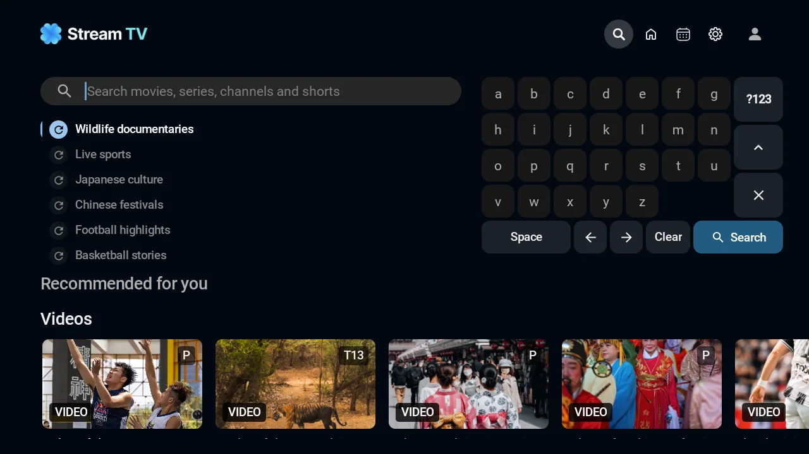

*Ô nhập, lịch sử tìm kiếm và grid bàn phím a–z cùng nằm trong viewport đầu tiên. Không có màn hình
nhập liệu riêng — người xem không phải rời kết quả để gõ. Bên dưới là "Recommended for you" tách
theo loại content.*

### Calendar — EPG dạng lưới hai chiều

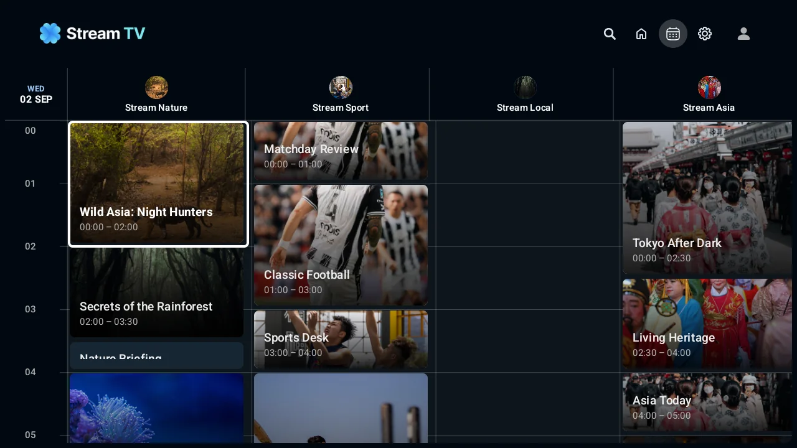

*Trục dọc là giờ, trục ngang là kênh. Ô chương trình cao theo đúng thời lượng, nên một chương trình
2 tiếng thực sự cao gấp đôi một chương trình 1 tiếng. Khoảng trống trong lịch phát là ô trống thật,
không phải placeholder. Focus là border trắng bao quanh ô.*

### Setting — hai pane, danh sách bên trái dẫn nội dung bên phải

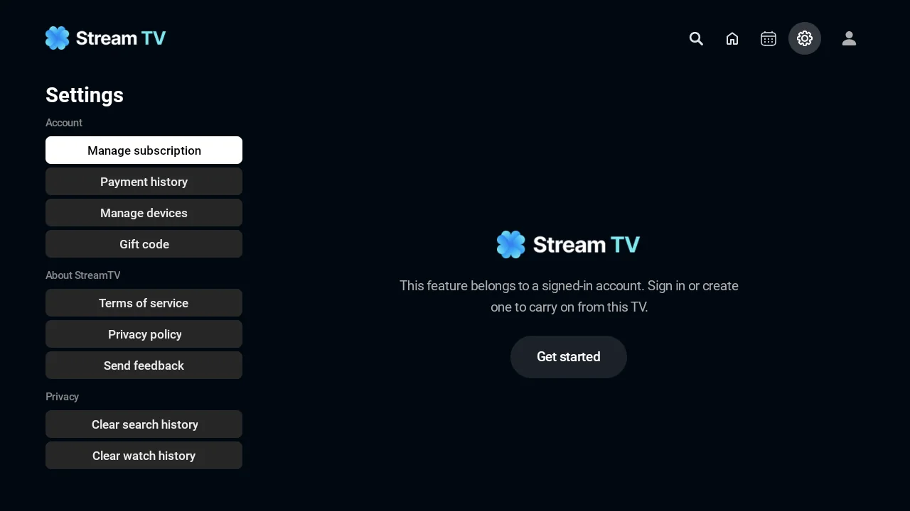

*Danh sách bên trái nhóm theo Account / About / Privacy. Item được chọn dùng nền trắng chữ đen thay
vì phóng to — trong một cột dày đặc, phóng to sẽ làm các item va vào nhau.*

### Profile — đăng nhập bằng thiết bị khác

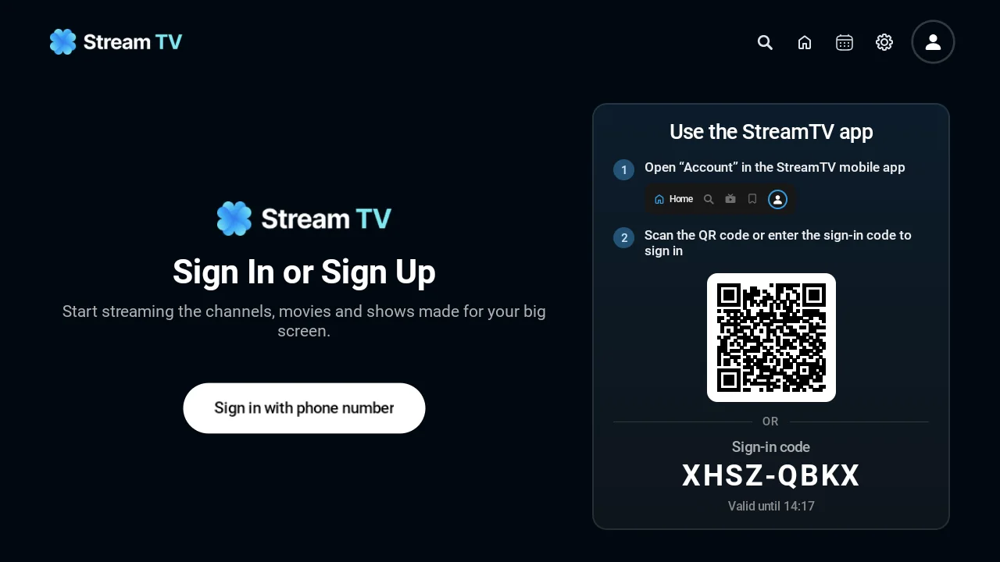

*Gõ mật khẩu bằng D-pad là trải nghiệm tệ, nên màn này ưu tiên QR code và mã đăng nhập có hạn dùng.
QR được render tại chỗ. Nút "Sign in with phone number" vẫn còn đó làm phương án dự phòng.*

---

## 4. Player ngang

`PlayerScreen` dành cho nội dung quay ngang: video, tập phim và kênh live. Video lấp đầy panel và
**mọi chi tiết giao diện đều là tạm thời**.

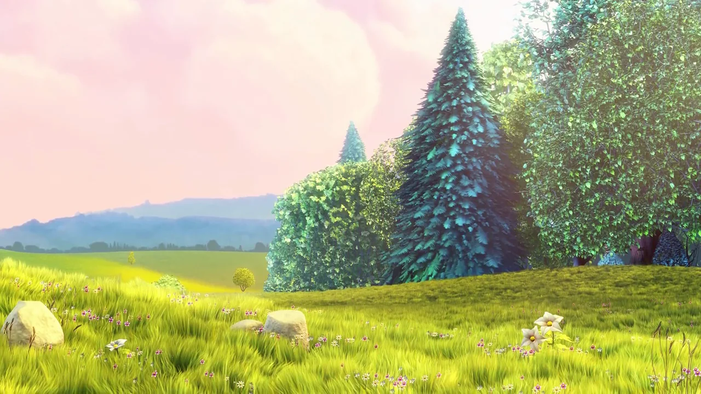

*Trạng thái mặc định: không có gì ngoài hình. Một full-screen input target vô hình giữ D-pad và
chờ phím đầu tiên.*

### Controller

Nhấn bất kỳ hướng nào để hiện controller. Nó chiếm hai mép trên/dưới và **để trống dải giữa**.

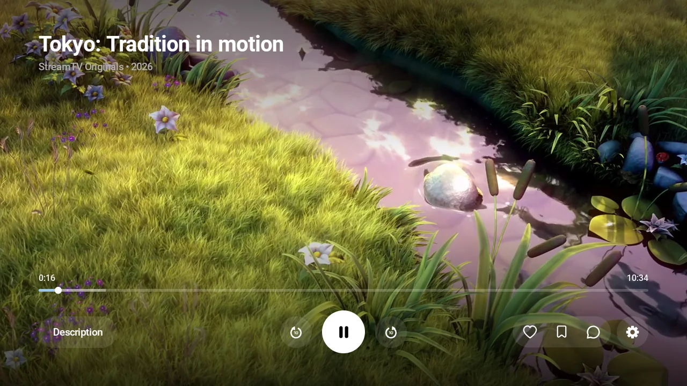

*Scrim dọc làm tối hai mép và hoàn toàn trong suốt ở giữa, nên chữ vẫn đọc được trên mọi khung hình
mà không làm mờ đúng phần người xem đang nhìn.*

Control row chia làm ba cụm:

| Cụm | Canh | Nội dung |
|---|---|---|
| Leading | Mép trái | Pill `Description` |
| Transport | **Canh giữa panel** | Rewind, play/pause, forward |
| Trailing | Mép phải | Like, save, comment trên một pill chung; settings trên vòng tròn riêng |

Cụm transport canh giữa **panel**, không phải canh giữa khoảng trống giữa hai cụm kia — nhờ vậy vị
trí của nó không nhảy khi stream không có settings và nút settings biến mất.

Nút được focus **không phóng to** mà **đảo màu**: nền trắng đục, glyph tối, kèm caption tên nút ngay
bên dưới. Một nút nằm trên pill chung nếu phóng to sẽ tràn ra khỏi pill.

Với stream live, seek bar được thay bằng một nhãn thời gian đã phát, badge `LIVE` đứng trước tiêu đề,
và rewind/forward biến mất.

### Xuống từ seek bar là quay về đúng nút vừa dùng

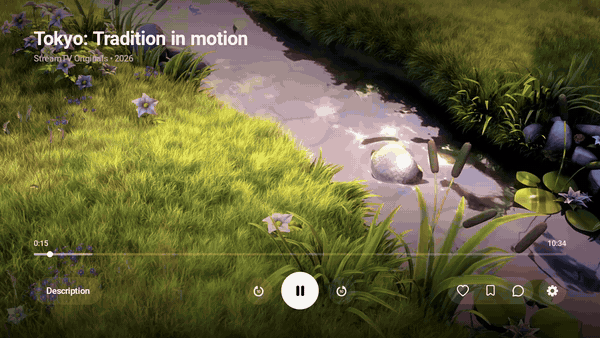

*Play/pause → sang phải tới **Save** → lên seek bar (thumb to ra, Save thôi tô trắng) → xuống lại
**Save**, không phải về play/pause.*

Chi tiết đáng nói: hành vi này **không** dùng `Modifier.focusRestorer` hay `saveFocusedChild()`. Cả
hai đều móc vào hook focus-search enter/exit, mà ở đây control row được rời và vào lại bằng
`FocusRequester` request trực tiếp — request đó đi vòng qua hook, nên restore luôn tìm thấy rỗng và
rơi về mặc định. StreamTV thay bằng việc nhớ control cuối cùng trong state.

Down từ control row **không làm gì cả**. Để nó rơi xuống là trao focus cho video surface, mà surface
thì lập tức ẩn cái controller người xem đang dùng.

### Ba side section

Cả ba mở ra ở mép phải trong một panel bo góc, tối, bán trong suốt.

<table>
<tr>
<td width="50%">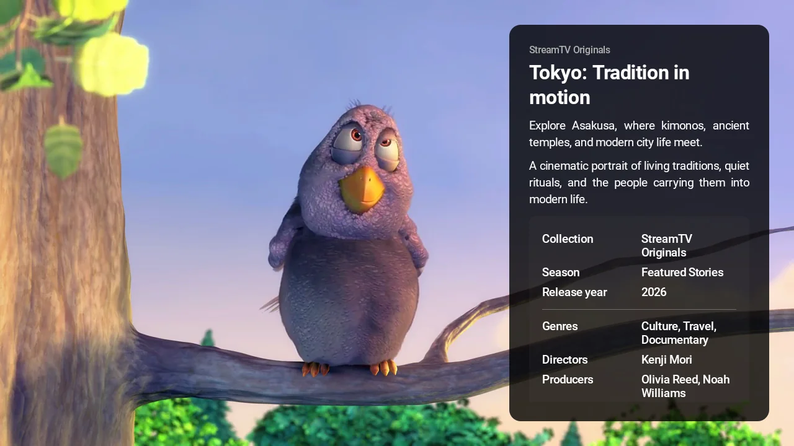</td>
<td width="50%">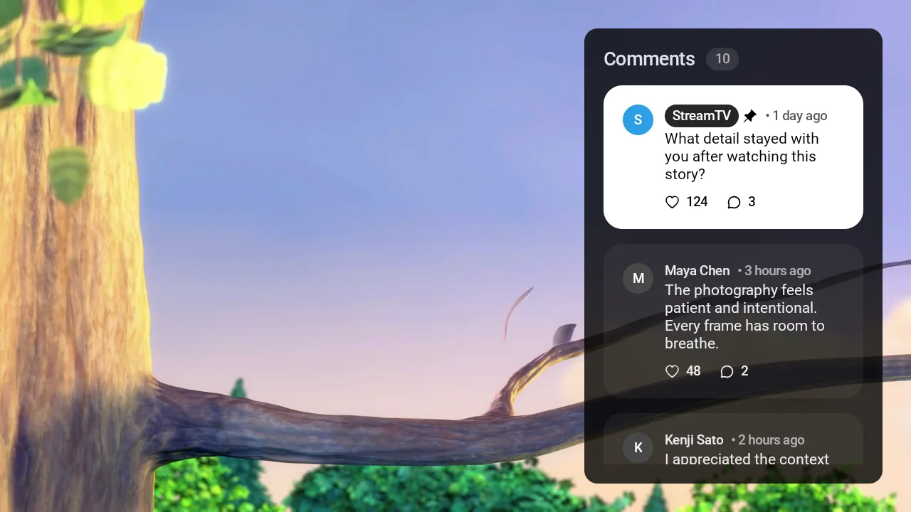</td>
</tr>
<tr>
<td><em><strong>Metadata</strong> — mở từ pill <code>Description</code>.</em></td>
<td><em><strong>Comments</strong> — có viewport cuộn bằng D-pad và scrollbar hiện theo focus; Up/Down cuộn tới biên rồi mới nhả phím cho focus đi tiếp.</em></td>
</tr>
</table>

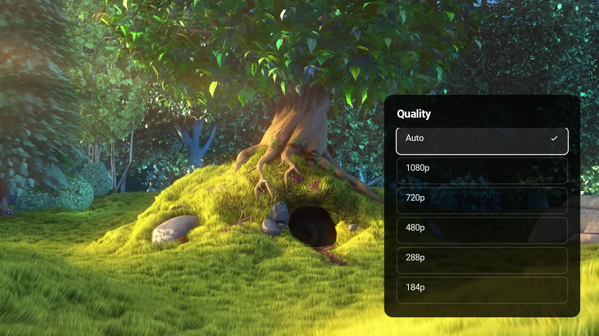

***Settings → Quality*** — *danh sách rendition đọc trực tiếp từ manifest HLS. Settings không hiển thị
category rỗng: stream này không có phụ đề hay audio thay thế nên panel gốc chỉ có đúng một dòng
Quality.*

Back từ một section trả focus về **đúng control đã mở nó** — Metadata về `Description`, Comments về
comment, Settings về settings. Back khi controller đang hiện chỉ ẩn controller; Back tiếp theo mới
thoát player.

---

## 5. Player dọc

Panel TV nằm ngang, còn short thì quay dọc. Thay vì letterbox thành hai dải hẹp hay crop mất đầu và
chân khung hình, `VerticalPlayerScreen` dựng một stage 9:16 ở giữa lệch trái và **trả phần chiều
rộng dôi ra cho chính nội dung**.

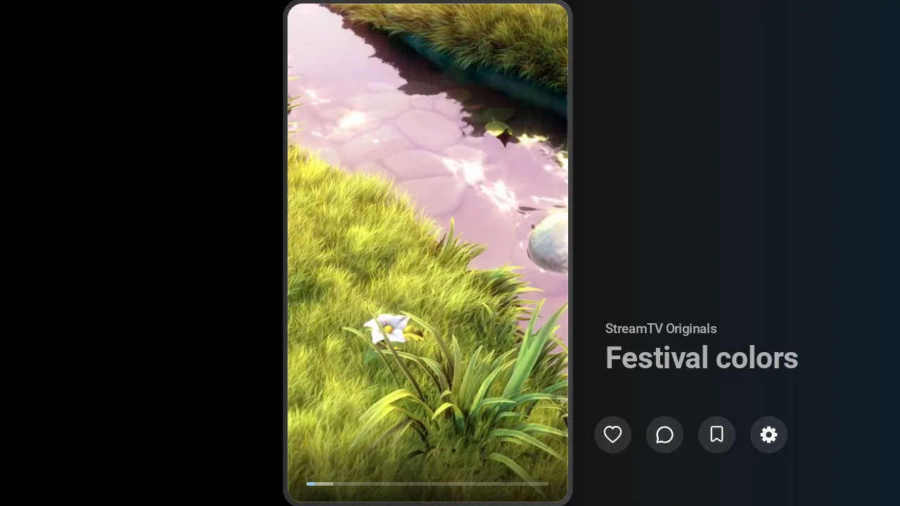

*Ba vùng: nền ambient gradient ngang, stage 9:16 bo góc (video crop để lấp đầy, không có dải đen bên
trong stage), và interaction panel bên phải. Stage có border focus trắng inset — nó là focus target
thật, không phải mặt phẳng thụ động.*

Màn này **không có** transport cluster, không seek bar, không pill `Description` và không caption
dưới nút. Bản thân stage là nút play/pause, và title block là cửa vào metadata.

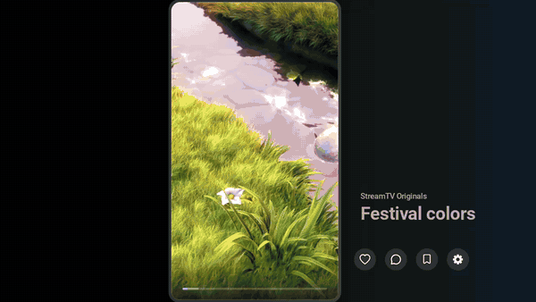

*Right từ stage vào thẳng **action đầu tiên** (không phải title block — title block ở một bước Up từ
đó); container title được tint để cả panel đọc như một vùng. Left từ action đầu quay về stage, còn
Left từ action sau chỉ dịch trong hàng.*

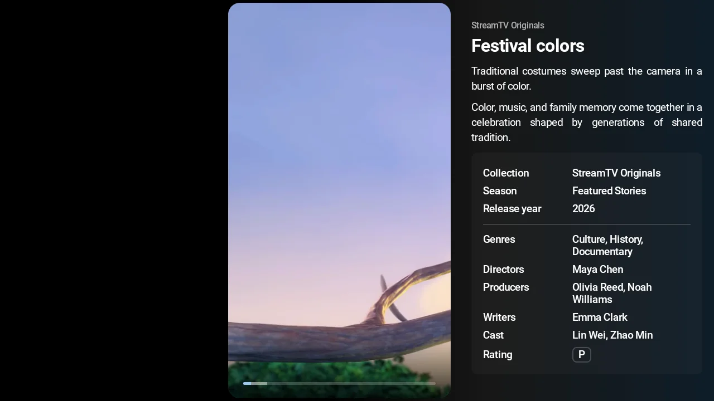

*Cùng một section tree với player ngang, nhưng ở đây panel vẽ **trong suốt** trên nền ambient thay vì
trong một panel bo góc. Khác biệt framing này nằm ở ranh giới screen, còn nội dung section thì dùng
chung.*

---

## 6. Hai player, một ViewModel

Cả hai màn dùng chung `PlayerViewModel`, chung retained section tree trong `component/section`, và
chung `StreamTvPlayerManager` từ thư viện `stream_player` (dự án riêng, xem
[`docs/player-integration/`](docs/player-integration/)). Khác biệt nằm ở tầng trình bày:

| | Player ngang | Player dọc |
|---|---|---|
| Khung hình | Letterbox, đầy panel | Crop vào stage 9:16 canh giữa |
| Nền | Chính video | Gradient ambient ngang |
| Vòng đời chrome | Tạm thời, tự ẩn sau 5s | Thường trực |
| Transport | Rewind, play/pause, forward | Không; stage là nút điều khiển |
| Seek bar | Focus được, có thumb và nhãn giờ | Vạch tiến độ không tương tác |
| Cửa vào metadata | Pill `Description` | Title block |
| Caption dưới nút | Có | Không |
| Panel section | Bo góc, tối, bán trong suốt | Trong suốt trên nền ambient |
| Đóng section | Back | Back hoặc Left |
| Focus sau khi đóng section | Về control đã mở nó | Về stage |

Hai điểm chung quan trọng nhất:

- **Đúng một group sở hữu D-pad tại mỗi thời điểm**, và group là *một giá trị derived duy nhất*, không
  phải một tập cờ độc lập. Thứ tự ưu tiên từ cao xuống thấp: `Error`, `Parked`, `Section`,
  `Controller`, `Surface`.
- **Focus được phát ra ở đúng một nơi.** Một subtree không được tự request focus cho mình trong lúc
  owner cũng đang quyết định — panel từng làm vậy đã đua với owner và thua, để lại màn hình không có
  gì focus được.

Đặc tả đầy đủ, gồm cả bảng focus graph và các kịch bản nghiệm thu:
[`spec/player.md`](spec/player.md) và [`spec/vertical-player.md`](spec/vertical-player.md).

---

## 7. Tự chụp lại bộ ảnh này

Mọi ảnh và GIF ở trên đều tái tạo được. Chúng không phải screenshot chụp tay rồi để trôi theo thời
gian.

```bash
python3 tools/capture_media.py list
python3 tools/capture_media.py shot player-controller
python3 tools/capture_media.py gif player-focus-restore
python3 tools/capture_media.py all
```

Yêu cầu: `adb` trên PATH với **đúng một** device đang kết nối, và `ffmpeg` để convert GIF.

Mỗi capture khai báo `setup` (đường phím để tới nơi, không quay) tách khỏi `steps` (chính phần biểu
diễn), và mỗi lần chạy đều force-stop rồi mở lại app, nên không capture nào thừa hưởng focus của
capture trước. Ảnh tĩnh xuất ra WebP, GIF qua palette hai lượt của ffmpeg. Đầu ra ghi vào
[`docs/images/`](docs/images/).

[`updateReadme.md`](updateReadme.md) là tài liệu vận hành đi kèm: sửa file nào thì phải chụp lại
capture nào, chỗ nào cần GIF chỗ nào chỉ cần ảnh tĩnh, và mỗi demo dùng item nội dung nào.

---

# Tham chiếu kỹ thuật

## Chức năng hiện tại

- TopBar điều hướng giữa Search, Home, Calendar, Setting và Profile bằng D-pad. Khi navigation nhận focus, app phủ một lớp `surface` bán trong suốt lên toàn bộ screen và giữ TopBar nổi phía trên.
- Home nhận một danh sách section dọc; mỗi section sở hữu `title`, `viewType` và danh sách content ngang.
- `Banner` full-width cao 600dp nằm phía sau TopBar overlay, dùng hero scrim nhiều lớp, CTA, edge pages, indicator và lifecycle-aware auto-scroll khi không focus.
- `VerticalBanner` hiển thị `Short` theo tỷ lệ 2:3, loop trên virtual pager dài khi có ít nhất 5 item, preload 5 page quanh viewport, scale item và đổi nền theo palette trích từ thumbnail active.
- Focus đầu tiên thuộc về Banner; nhấn Up quay lại TopBar. Trái/phải chuyển item ngay trong carousel.
- `Videos`, `ListSeries`, `Channels` và `Shorts` dùng `ContentRow`: horizontal lazy layout với selector cố định tại leading content edge và luôn đo thêm item ngoài hai biên để chuyển động không lộ khoảng trống.
- Ảnh online được tải bằng Coil 3; dummy `videoUrl` và `trailerUrl` dùng HLS test stream (`trailerUrl` lấy từ cùng pool VOD nhưng xoay lệch một bậc nên không trùng `videoUrl` của chính item đó) và `logoUrl` đang để trống.
- Dependency injection dùng Hilt; graph được kiểm tra và tạo code tại compile time bằng KSP.

## Cấu trúc Home feature

```text
feature/home/
├── data/
│   ├── model/                  # DTO đa hình và viewType từ nguồn dữ liệu
│   ├── source/                 # HomeDummyDataSource
│   ├── mapper/                 # DTO -> domain
│   └── repository/             # DummyHomeRepository adapter
├── domain/
│   ├── model/                  # Content, Video, Series, Channel, Short, HomeSection
│   └── repository/             # Suspend HomeRepository contract
└── presentation/
    ├── component/              # HomeContent, Banner, BannerTrailer, VerticalBanner, ContentRow section, card
    ├── mapper/                 # Domain -> UI model
    ├── model/                  # UI item và UI viewType
    ├── HomeRoute.kt            # HomeScreen: bind ViewModel, cấp trailer slot cho banner
    ├── HomeUiState.kt
    ├── HomeViewModel.kt
    ├── HomeBannerTrailerUiState.kt   # UiState + pure fold quyết định khi nào hiện video
    └── HomeBannerTrailerViewModel.kt # sở hữu một player cho trailer của banner
```

App composition root nằm tại `app/di/HomeModule.kt`. Presentation không tự khởi tạo data source hoặc repository.

## Navigation

Navigation chia làm hai graph. `MainScreen` là shell duyệt nội dung: sở hữu `StreamTvTopBar` và một
`MainNavHost` lồng bên trong. Hai màn player là anh em của `MainScreen` ở graph ngoài, nên chiếm trọn
màn hình mà không ai phải ẩn TopBar.

```
StreamTvNavHost (ngoài)
├── MainRoute ─────────► MainScreen
│                        ├── StreamTvTopBar
│                        └── MainNavHost (trong)
│                            ├── HomeRoute
│                            ├── SearchRoute
│                            ├── SettingRoute
│                            └── ProfileRoute
├── PlayerRoute
└── VerticalPlayerRoute
```

- Một destination có TopBar khi và chỉ khi nó được đăng ký trong `MainNavHost`. Không còn predicate
  `isPlayerRoute` so khớp prefix route để quyết định ẩn bar.
- Back không cần code thêm: NavHost trong xử lý trước, hết stack thì rơi xuống NavHost ngoài.
- `MainNavHost` không thấy controller ngoài, nên mở player đi qua `onOpenPlayer` /
  `onOpenVerticalPlayer`. Chọn player nào vẫn do `HomeContentUiItem.playerTarget()` quyết định.
- Mỗi feature duyệt nội dung chỉ còn **một** composable `XxxScreen`, đặt trong `XxxRoute.kt`. Home
  giữ phần UI stateless tách riêng là `HomeContent` vì nó lớn và là thứ Compose test chạy vào.

Chi tiết quyết định, phương án thay thế và hệ quả: [`docs/adr/2026-09-01-nested-main-navigation.md`](docs/adr/2026-09-01-nested-main-navigation.md).

## Dependency injection với Hilt

- `StreamTvApplication` dùng `@HiltAndroidApp` để tạo application-level container.
- `MainActivity` dùng `@AndroidEntryPoint` để kết nối Android entry point với Hilt graph.
- `HomeModule` được cài vào `SingletonComponent`; module cung cấp `HomeDummyDataSource`, `HomeRepository` và `HomeUiMapper`.
- `PlayerModule` cung cấp `StreamTvPlayerFactory`, `PlayerDummyDataSource` và
  `PlayerDetailsRepository`; UI không khởi tạo data source hoặc ExoPlayer trực tiếp.
- Toàn bộ `HomeViewModel`, `SearchViewModel`, `SettingViewModel`, `ProfileViewModel` dùng `@HiltViewModel` và constructor injection.
- Mọi feature Route lấy ViewModel bằng `hiltViewModel()`; không còn factory hoặc dependency container thủ công trong production code.

Domain giữ nguyên thuần Kotlin. Hilt wiring chỉ nằm tại app composition root và presentation entry point, nhờ đó có thể thay dummy repository bằng remote repository mà không sửa ViewModel hoặc UI.

## Luồng dữ liệu

```text
HomeDummyDataSource
    -> DummyHomeRepository
    -> HomeDataMapper
    -> HomeViewModel
    -> HomeUiMapper
    -> HomeUiState
    -> HomeScreen
    -> HomeContent
```

`HomeViewModel` gọi suspend repository trực tiếp trong `viewModelScope`, hủy request cũ khi reload và không nuốt `CancellationException`. `PlayerViewModel` gọi `PlayerDetailsRepository` trực tiếp (không có use case trung gian), rồi `combine` playback state với content/action state thành immutable `PlayerUiState` bằng `stateIn(SharingStarted.Eagerly)`.

`Content` là sealed hierarchy gồm:

- `Video`: một video đơn lẻ, thumbnail 16:9.
- `Series`: content có thêm `episodes: List<Video>`.
- `Channel`: content phát live.
- `Short`: video dọc, thumbnail 2:3.

Mọi content có `id`, `videoUrl`, `trailerUrl`, `thumbnailUrl`, `vastUrl`, `title`, `description`, `ageRestriction`, `logoUrl`. `id` được thêm để cung cấp stable key cho Compose; hậu tố `Url` của `logoUrl` làm rõ kiểu dữ liệu.

Quan hệ hợp lệ được kiểm tra tại constructor của `HomeSection` và `HomeSectionUiItem`:

| `viewType` | Loại item bắt buộc |
|---|---|
| `Banner` | `Video` |
| `VerticalBanner` | `Short` |
| `Videos` | `Video` |
| `ListSeries` | `Series` |
| `Channels` | `Channel` |
| `Shorts` | `Short` |

Section sai kiểu bị từ chối ngay tại boundary thay vì bị lọc âm thầm trong Compose.

## Ảnh dummy

Dummy thumbnail dùng ảnh từ Pexels cho các chủ đề sport, animal, Chinese culture và Japanese culture.

Dummy sections cố ý bao gồm cả hai boundary của `ContentRow`: Videos có 8 item, Channels có 6 item và Shorts có 8 item để chạy loop; Documentary Series có 4 item để giữ finite.

- [Basketball](https://www.pexels.com/photo/men-playing-basketball-9839903/)
- [Football](https://www.pexels.com/photo/soccer-player-on-field-during-match-36958062/)
- [Cricket](https://www.pexels.com/photo/a-man-holding-a-wooden-paddle-11023865/)
- [Bengal tiger](https://www.pexels.com/photo/tiger-in-a-forest-25785873/)
- [Tiger portrait](https://www.pexels.com/photo/photo-of-a-tiger-12167844/)
- [Chinese festival](https://www.pexels.com/photo/vibrant-traditional-chinese-cultural-festival-30765119/)
- [Chinese New Year](https://www.pexels.com/photo/young-woman-celebrating-lunar-new-year-outdoors-36603900/)
- [Tokyo street](https://www.pexels.com/photo/people-walking-in-city-in-japan-12343886/)
- [Japanese ceremony](https://www.pexels.com/photo/traditional-japanese-ceremony-with-participants-31370378/)

## Focus trên Android TV

StreamTV không dùng `FocusRequesterModifiers` của dự án tham chiếu. Hành vi focus được khai báo tại composable sở hữu nó:

- `HomeBannerSection` gắn `contentFocusRequester` và khai báo `up = topBarFocusRequester`.
- Banner và VerticalBanner tự xử lý D-pad trái/phải bằng `onPreviewKeyEvent`.
- Auto-scroll dừng khi carousel nhận focus.
- Trailer chỉ chạy khi carousel đang giữ focus và screen đang RESUMED. Một `LaunchedEffect` key theo `(item, isBannerFocused, isScreenResumed)` lo cả delay 5 giây lẫn điểm dừng duy nhất trong `finally`, nên mọi đường ra — mất focus, đổi item, dispose, navigate — đều dừng player.
- Item TopBar khai báo hướng Down về content focus requester.
- `HomeContent` theo dõi section nào đang giữ focus qua `onFocusChanged` và bật overlay TopBar khi index lớn hơn 0. `MainScreen` tự hạ overlay mỗi lần đổi destination.

### ContentRow

Base component nằm tại `core/designsystem/component/contentrow` và cung cấp DSL gần với `LazyRow`:

```kotlin
val state = rememberContentRowState()

ContentRow(state = state) {
    items(
        items = videos,
        key = VideoUiItem::id,
    ) { video ->
        VideoCard(video)
    }
}
```

- `ContentRow` được xây trên `LazyLayout`; chỉ item trong vùng nhìn thấy và vùng đệm sát viewport được compose/measure.
- Toàn bộ row chỉ có một focus target là `SelectedItem` trong suốt có border, cố định tại leading content edge. Card bên dưới không được gắn `focusable`.
- Border selector rộng hơn content 2dp ở mỗi cạnh, tạo khoảng thở mà không thay đổi kích thước card.
- D-pad Left/Right dịch chuyển danh sách bên dưới selector; Center/Enter gọi callback của real selected index.
- Khi di chuyển sang phải, item trước trượt ra ngoài leading edge nhưng vẫn để lại một phần nhỏ ở mép màn hình trong lúc row đang ở các index tiếp theo.
- Ở item `0`, không có item giả phía trái và D-pad Left trả quyền xử lý về `FocusRequester.Default`.
- Khi có hơn 5 item, provider nối thêm một cycle đầy đủ của collection. Vì vậy ở gần cuối row vẫn luôn thấy các item `0, 1, 2...` phía sau; sau animation qua cuối, state rebase về cycle đầu mà không tạo khoảng trống hoặc nhảy hình.
- Collection có tối đa 5 item giữ finite: D-pad Right tại item cuối không reset về item `0`.
- `ContentRowState.scrollToItem(index)` wrap index đối với row loop và clamp index đối với row finite.

## Player

Player là destination full-screen ở graph ngoài và có hai cách trình bày dùng chung một
`PlayerViewModel`:

- `PlayerScreen` phát nội dung ngang bằng surface 16:9. Controller là overlay trong `Box`, tự ẩn sau
  5 giây khi video đang chạy và chỉ có title, Like, Save, Comment, Settings cùng duration/progress; không có
  related/episodes và không dùng `LazyColumn` cho content.
- `VerticalPlayerScreen` giữ stage 9:16 ở giữa lệch trái, nền ambient tối và interaction section ở
  bên phải. D-pad Right đi từ player sang action đầu tiên; D-pad Left quay về player.
- Cả hai orientation dùng chung retained section tree trong `component/section`: Metadata,
  Comments → Replies → Reply detail và Settings → Quality/Subtitles/Audio. Parent vẫn được compose
  phía dưới child để giữ list state và item đã chọn.
- Khi section bắt đầu enter hoặc child bắt đầu exit, focus được chuyển vào một pending target luôn
  tồn tại. Sau animation, section mới nhận focus; điều này ngăn Compose tự nhảy focus về player hoặc
  một control khác trong lúc node đang biến mất.
- Player ngang nhớ chính xác control đã mở root section: Back từ Metadata về `Description`, từ Comments về
  Comment và từ Settings về Settings. Back khi controller đang hiện chỉ ẩn controller; Back tiếp theo
  mới thoát player.
- Player dọc dùng Left hoặc Back để pop từng level. Child trở về đúng row đã mở nó; root trở về portrait
  player, sau đó Right mới đưa focus sang interaction section.
- Track snapshot từ `stream_player` được map một lần tại `presentation/mapper`. Chọn option dispatch
  trực tiếp `selectVideoTrack`, `selectTextTrack` hoặc `selectAudioTrack` qua `PlayerViewModel`.
- Settings không hiển thị category rỗng; Subtitles có option Off và Quality có Auto khi manifest có
  nhiều rendition.
- Metadata và comment dummy lấy từ `PlayerDummyDataSource`, qua
  `DummyPlayerDetailsRepository -> domain model -> PlayerDetailsUiMapper -> PlayerUiState`; toàn bộ copy
  hiển thị là tiếng Anh.

## Thêm một ContentRow section

1. Map view type về một `HomeContentRowStyle` trong `HomeScreen.kt`.
2. Truyền typed items qua `requireItemsOfType()`; mapper và model đã bảo vệ đúng loại item.
3. Render card trong DSL của `ContentRow`, cung cấp stable `key` và `contentType`.
4. Không gắn `focusable` vào card; focus, loop và D-pad đã được encapsulate trong base component.

## Đặc tả từng màn

`spec/` là product contract không phụ thuộc framework — đọc trước khi implement hoặc port sang nền
tảng khác.

| Màn | Đặc tả |
|---|---|
| Nền tảng chung, top bar, D-pad contract | [`spec/README.md`](spec/README.md) |
| Home | [`spec/home.md`](spec/home.md) |
| Player ngang | [`spec/player.md`](spec/player.md) |
| Player dọc | [`spec/vertical-player.md`](spec/vertical-player.md) |
| Search | [`spec/search.md`](spec/search.md) |
| Calendar | [`spec/calendar.md`](spec/calendar.md) |
| Setting | [`spec/setting.md`](spec/setting.md) |
| Profile | [`spec/profile.md`](spec/profile.md) |

## Build và test

Yêu cầu JDK 17 trở lên và Android SDK 37.

```bash
./gradlew :app:assembleDebug
./gradlew :app:testDebugUnitTest
./gradlew :app:assembleDebugAndroidTest
./gradlew :app:lintDebug
```

APK debug được tạo tại `app/build/outputs/apk/debug/app-debug.apk`.
